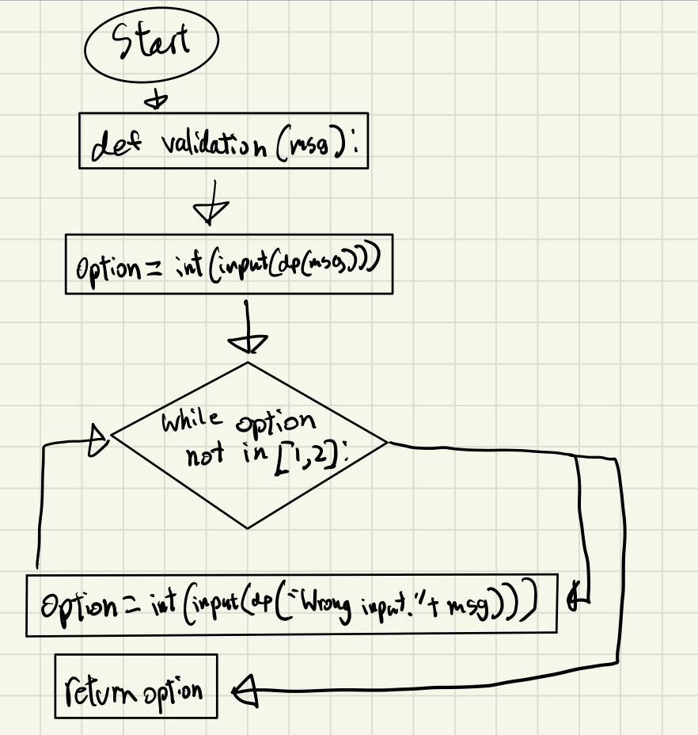
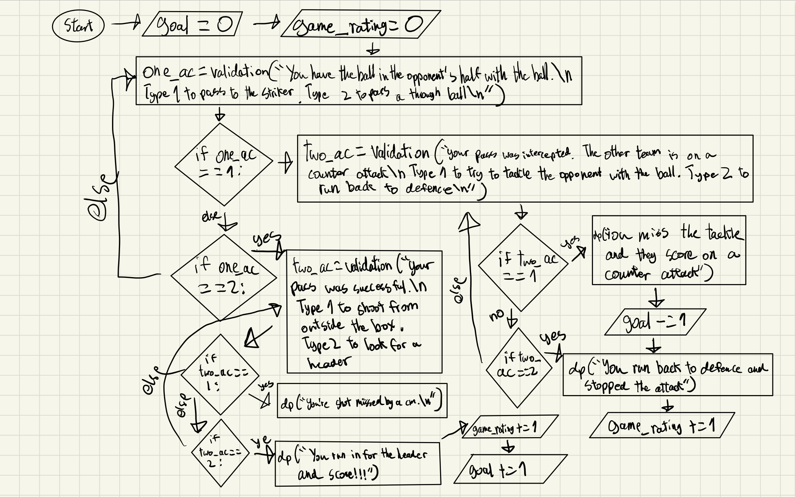

# Unit 1: A classic game 


# Criteria A: Planning

## Problem definition

The owner of the local game shop is an enthusiast of classic computer games. He has been looking for a talented programmer that can help him revive his passion for text-based games. He has few requirements for this task:

1. The game has to be entirely text-based.
2. The game must record the time played.
3. The game must record the player name and score.

Apart for this requirements, the owner is open to any type of game, topic or genre. 

## Personal Problem Definition.

Ever since I was little, I would watch the Champions League with family and friends anually. It was a competition that would bring people together with so much joy and excitement. Even if my favorite team could never win, I had a lot of fun watching the tournament. Thus, I wanted to turn all this nostalgia, joy, and excitement into a game. Additionally, I have seen many text-based games that are focused on mystery or survival. However, it is extremely rare to find a text-based game for football. Hence why I decided to create a football game based on the Champions League.

# Proposed Solution


## Success Criteria

1. The game will calculate how well a user did in the game based on their rating.
2. It must validate user inputs.
4. The game will be a career mode video game based on the champions league. Meaning, the user will become a professional football player and play in the Champions League in the game. 
6. The video game save the rating, time spent, and username of a user.
7. The user will have a rating which can be improved based on their proformances in matches.
8. The game will be available in English and Japanese.

## Design Statement

I will design and make a classic video game for a client who is looking for a text-based video game with a record of player names and scores. The theme of the video game is football and is constructed using the software python 3.x. It will take a month to make and will be evaluated according to the success criteria mentioned prior.

## Justification

For this game, I will be using python which is, according to statisticstimes.org, the most used coding language in the world and the language I am most comfortable using. Additionally, according to cisin.com, Python is the most versatile language in the world. My text-based game will be coded on the MacOS system and on a Python editor called "PyCharm". Pycharm was chosen as it is simple and easy to code on. Furthermore, it is very easy to store files in. As the client did not have many requirments, I was free to pick my own theme and structure if it met the three requests.

## Details

My game, "Champions League Career", will be a text-based game that will allow users to play a Champions League tournament with real teams. The game will include a randomisation of the tournament bracket to ensure the game will differ each time the user plays. Furthermore, the games the user doesn't play will be simulated. The game will consist of decisions that have to be made by the users that will affect the outcome of a match. To win the game, one has to win every match and win the tournament. If one loses a match, it will be game over and they will have to replay the game. Each match will contain three to four decision points. Each decision point throughout the game differ from each other. The game will save the user's username, rating, and time spent on the game. Therefore, if the user were to play the game again, they can look at their previous score. 

# Criteria B: Design

## System Diagram


Figure 1. System diagram for the proposed solution.

As shown in Fig.1, the proposed solution runs on Python and it is developed using Pycharm (v. 2021). The proposed game, "Champions League Legend" has two inputs (1 and 2). Depending on the input, the output will differ in game situations.

## Flow Diagrams


Figure 2. Flow dagram of the entire game

As shown in Fig.2, the game will consist of a plethora of choices carried on by the users. Depending on the choices, the ending of the game will differ as well. Although Fif.2 does not contain all the details of the game, it contains the key elements.


Figue 3. Flow diagram of tournament bracket making

As shown in Fig3, the game will contain a bracket making system. This system will randomly place teams into each seed.


Figure 4. Flow diagram of encoder

As shown in Fig. 4, there will be an encoder at the end of the game to store the data of the users in a manner which is safe. If the file is leaked, the encoder will ensure that no one is able to find personal details about the users.



Figure 5. Flow diagram of validation function 

As shown in Fig.5, there will be a validation function to validate whether a user input is correct. If not, the user will have to re-enter their input.



Figure 6. Flow diagram of a match scenario

As shown in Fig. 5, a scenario in a match includes user inputs and depending on the inputs, different outputs will display.


Figure 7. First unit testing evidence


Figure 8. Second unit testing evidence


Figure 9. Introduction of the game showcasing the code review

## Test Plan

|                                                                                                    Description                                                                                                    |         Type        |                                                                                Inputs                                                                                |                                                                                                                                                                                           The Output                                                                                                                                                                                           |                                                                                                   Evidence of Output                                                                                                  |
|:-----------------------------------------------------------------------------------------------------------------------------------------------------------------------------------------------------------------:|:-------------------:|:--------------------------------------------------------------------------------------------------------------------------------------------------------------------:|:----------------------------------------------------------------------------------------------------------------------------------------------------------------------------------------------------------------------------------------------------------------------------------------------------------------------------------------------------------------------------------------------:|:---------------------------------------------------------------------------------------------------------------------------------------------------------------------------------------------------------------------:|
| Testing if the system which creates the tournament bracket works randomly.                                                                                                                                        | Unit Testing        | 1. Initiate the program.  2. Enter the teams that you would like to be in the tournament                                                                             | Randomly places teams against each other for the round of 16.                                                                                                                                                                                                                                                                                                                                  | Figure 7.                                                                                                                                                                                                             |
| Test if the validation function works.                                                                                                                                                                            | Unit Testing        | 1. Initiate the program.  2. When asked to input 1 or 2, input 3.                                                                                                    | As the input was not 1 or 2, it prints "Wrong input." and the same message will print again.                                                                                                                                                                                                                                                                                                   | Figure 8.                                                                                                                                                                                                             |
| Test if the entirety of one match works with the correct outputs.                                                                                                                                                 | White Box Testing   | 1. Initiate the program.  2. Input the first scenario.  3. Input the second scenario.  4. Input the third scenario.                                                  | Depending on if the user chooses the right decision in the scenarios, they will win or lose. The game will accurately decide if the user won or lost. Furthermore, it will alter their rating according to their choices in the game.                                                                                                                                                          | https://www.youtube.com/watch?v=LoLProu7Gio                                                                                                                                                                           |
| Test if the transition from one match to another works smoothly to see the interaction between different parts of the game.                                                                                       | Integration Testing | 1. Initiate the program.  2. Play the first match. 3. Play the second match.                                                                                         | After a match is finished, if the user wins, firstly, it will print that they are moving onto the next round. Secondly, it will display their new rating. Thirdly, the rest of the matches of the round will be simulated. Fourthly, the matches of the next round will be simulated. Lastly, the user will be able to play the next match.                                                    | https://www.youtube.com/watch?v=8puYHrBsWjs                                                                                                                                                                           |
| Test if the entire game works with the correct outputs and meets all the requirements by the client: 1. Must be a text-based game. 2. Must record the time played 3. Must record the scores (rating) and username | System Testing      | 1. Initiate the program.  2. Complete the introduction.  3. Finish the round of 16.  4. Finish the quarter-finals.  5. Finish the semi-finals.  6. Finish the final. | The game will smoothly play through each match and depending on the results of the matches, the game will print the accurate outcome. The game will show the rating and the time spent on the game. The game will end with the user either winning or losing the tournament. Furthermore, the game will ask if the user would like to save their username, rating, and time spent on the game. | https://www.youtube.com/watch?v=y8yJ-U5exgw                                                                                                                                                                           |
| Reviews if the code has adequate comments, function name, and variable name.                                                                                                                                      | Code Review         | As this is a review, there are no inputs.                                                                                                                            | The code will contain comments to detail how the code works. Names of functions and variables will be adequate to eliminate confusing.                                                                                                                                                                                                                                                         | This can be seen in Figure 9. where the introduction of the game is shown.                                                                                                                                            |
| Testing how smooth the inputs load by playing the introduction.                                                                                                                                                   | Load Testing        | 1. Initiate the program. 2. Input what language you would like to play 3. Input if you have played the game before. 4. Input a username 5. Pick a team to play in    | The introduction will be smooth and it will load smoothly as well. When the user places an input, the game will smoothly give an output. For it to be smooth, it must have delays and it must clear occasionally making the game look clean.                                                                                                                                                   | https://www.youtube.com/watch?v=O7HBPjzFFHg                                                                                                                                                                           |
| Testing whether this game is easy to use. This is shown by the video of me playing the game                                                                                                                       | Usability Testing   | 1. Initiate the program 2. Play the game until the end                                                                                                               | The game should be easy to understand and inputs should be easy to do. Furthermore, instructions should be clear for the users.                                                                                                                                                                                                                                                                | This is show by the video of me playing the game. As you can see, the game has simple instructions which make it easy for the users to understand how to play this game.  https://www.youtube.com/watch?v=y8yJ-U5exgw |

## Record of Tasks
| Task No |                  Planned Action                 |                                                  Planned Outcome                                                  | Time estimate | Target completion date | Criterion |
|:-------:|:-----------------------------------------------:|:-----------------------------------------------------------------------------------------------------------------:|:-------------:|:----------------------:|:---------:|
| 1.      | Write a proposed solution                       | To find a solution that solves the client's problems                                                              | 15 minutes    | September 20           | A         |
| 2.      | To create a success criteria                    | To find ways to evaluate whether my solution is successful or not                                                 | 15 minutes    | September 20           | A         |
| 3.      | Create system diagram.                          | To have a clear idea of the hardware and software of the program                                                  | 10 minutes    | September 20           | B         |
| 4.      | code an introduction for the user               | For the users to understand how to play the game.                                                                 | 1 hour        | September 18           | C         |
| 5.      | Code a system that randomly generates a bracket | To generate random matches in a tournament style.                                                                 | 2 hours       | September 22           | C         |
| 6.      | Create a system that simulates random matches   | To have codes so that some matches can be simulated                                                               | 2 hour        | September 25           | C         |
| 7.      | Create an encryption for the user data          | A function tested that uses the Cesar Cypher                                                                      | 20 minutes    | October 6              | C         |
| 8.      | Create game scenarios                           | To create scenarios similar to what would happen in a real football game.                                         | 2 hours       | October 10             | C         |
| 9.      | Find an ASCII text                              | For the trophy when the user wins.                                                                                | 10 minutes    | October 12             | C         |
| 10.     | Add a delay function                            | To make the game run better                                                                                       | 15 minutes    | October 13             | C         |
| 11.     | Add a validation function                       | So that if the user inputs something that is not a 1 or a 2, it will ask the user until they put the right input. | 20 minutes    | October 13             | C         |
| 12.     | Add a clear function                            | To make the game run more smoothly                                                                                | 15 minutes    | October 13             | C         |
| 13.     | Organize everything into one game               | Organize everything so that the game can run smoothly                                                             | 30 minutes    | October 15             | C         |
| 14.     | Create the first flowchart                      | Create a flowchart that shows the general flow of the entire game                                                 | 30 minutes    | October 18             | B         |
| 15.     | Create the second flowchart                     | Create a flowchart that showcases how the tournament bracket is randomly generated.                               | 30 minutes.   | October 18             | B         |
| 16.     | Create the third flowchart                      | Create a flowchart that showcases how the game encodes users' information.                                        | 30 minutes    | October 23             | B         |
| 17.     | Create a Japanese version of the game.          | Code a Japanese game so that there are two language options                                                       | 2 hours       | October 25             | C         |
| 18.     | Create the testing plan.                        | create a table with all the testing that is done on my game.                                                      | 30 minutes    | October 26             | B         |

## Minimum Viable Product

The following is my MVP which is the basic demonstration of my game. My MVP includes the basic outline of my entire game without many features. This was sent to the client and this was his feedback:
1. There was a bug as there was no validation.
2. There are not enough comments.
3. The code is hard to follow because there are many variables with the same name
I showed the MVP to my friends which I recevied feedback from. 
1. It didn't meet all the requirements from the client.
2. It wasn't very smooth and should have a delay function.
3. Choosing a position does not do much as it is not needed in the game.
4. As said in the success criteria, it should be in both Japanese and English.
5. Should implement a rating system.
6. Should be able to join any team they want from the game.
I took the feedback and implemented it into my final game which is below the MVP.
```.py
import os
import time
time.sleep(1.5)
import sys
# printing in a slow manner
def dp(str):
    for char in str:
        sys.stdout.write(char)
        sys.stdout.flush()
        time.sleep(0.025)
    return ""
# clearing the texts
def clear():
    os.system("clear")
# Validation for the scenarios
def validation(msg):
    option = int(input(dp(msg)))
    while option not in [1, 2]:
        option = int(input(dp("Wrong input" + msg)))
    return option
# Introduction to the game
username = input(dp("Welcome to Champions League Career! Please input your username: \n"))
dp(f"Hi {username}! This game is a simulation of a Champions League. \n")
dp("You will be making decisions which will affect your player's rating.\n ")
dp("Your player's current rating is 70. The maximum rating is 99. \n ")
clear()
rating = 70
age = 20
dp("For your player's first team, please pick between: Sevilla, Atalanta, Porto, Milan: \n ")
first_team = input(dp("Please enter the name of the team you would like to join here: \n "))
while first_team not in "SevillaAtalantaPortoMilan":
    first_team = input(dp("Wrong input. Please enter the team name including the first letter being capital: \n"))
dp(f"Welcome {username} to your first team {first_team}. \n")
clear()
#print("If you would like to be a goalkeeper, type: GK. ")
#print("If you would like to be a defender, type: DF. ")
#print("If you would like to be a midfielder, type: MF. ")
#print("If you would like to be an attacker, type: AC. ")
#position = input("Enter here: ")
#while position not in "GKDFMFAC":
    #position = input("Wrong input. Please enter either 'GK','DF', 'MF', 'AC': ")
# System to create the round of 16 randomly
import random
first_teams = ["Milan", "Atletico Madrid", "Real Madrid", "Dortmund", "Barcelona", "Atalanta", "Sevilla", "Juventus"]
second_teams = ["Manchester City", "PSG", "Chelsea", "Bayern", "Manchester United", "Liverpool", "Inter Milan", "Porto"]
first_bracket = random.choice(first_teams)
second_bracket = random.choice(second_teams)
first_teams.remove(first_bracket)
second_teams.remove(second_bracket)
third_bracket = random.choice(first_teams)
fourth_bracket = random.choice(second_teams)
first_teams.remove(third_bracket)
second_teams.remove(fourth_bracket)
fifth_bracket = random.choice(first_teams)
sixth_bracket = random.choice(second_teams)
first_teams.remove(fifth_bracket)
second_teams.remove(sixth_bracket)
seventh_bracket = random.choice(first_teams)
eighth_bracket = random.choice(second_teams)
first_teams.remove(seventh_bracket)
second_teams.remove(eighth_bracket)
ninth_bracket = random.choice(first_teams)
tenth_bracket = random.choice(second_teams)
first_teams.remove(ninth_bracket)
second_teams.remove(tenth_bracket)
eleventh_bracket = random.choice(first_teams)
twelfth_bracket = random.choice(second_teams)
first_teams.remove(eleventh_bracket)
second_teams.remove(twelfth_bracket)
thirteenth_bracket = random.choice(first_teams)
fourteenth_bracket = random.choice(second_teams)
first_teams.remove(thirteenth_bracket)
second_teams.remove(fourteenth_bracket)
fifteenth_bracket = random.choice(first_teams)
sixteenth_bracket = random.choice(second_teams)
dp("Now, the Champions League starts! The tournament starts with a round of 16. The following are the matches! \n")
dp(f"{first_bracket} versus {second_bracket} \n")
dp(f"{third_bracket} versus {fourth_bracket} \n")
dp(f"{fifth_bracket} versus {sixth_bracket} \n")
dp(f"{seventh_bracket} versus {eighth_bracket} \n")
dp(f"{ninth_bracket} versus {tenth_bracket} \n")
dp(f"{eleventh_bracket} versus {twelfth_bracket} \n")
dp(f"{thirteenth_bracket} versus {fourteenth_bracket} \n")
dp(f"{fifteenth_bracket} versus {sixteenth_bracket} \n")
clear()
if first_team == first_bracket:
    dp(f"You are going to go against {second_bracket} \n")
    first_team = first_bracket
    main_match = [first_bracket , second_bracket]
elif first_team == second_bracket:
    dp(f"You are going to go against {first_bracket} \n")
    first_team = second_bracket
    main_match = [first_bracket, second_bracket]
elif first_team == third_bracket:
    dp(f"You are going to go against {fourth_bracket} \n")
    first_team = third_bracket
    main_match = [third_bracket, fourth_bracket]
elif first_team == fourth_bracket:
    dp(f"You are going to go against {third_bracket} \n")
    first_team = fourth_bracket
    main_match = [third_bracket, fourth_bracket]
elif first_team == fifth_bracket:
    dp(f"You are going to go against {sixth_bracket} \n")
    first_team = fifth_bracket
    main_match = [fifth_bracket, sixth_bracket]
elif first_team == sixth_bracket:
    dp(f"You are going to go against {fifth_bracket} \n")
    first_team = sixth_bracket
    main_match = [fifth_bracket, sixth_bracket]
elif first_team == seventh_bracket:
    dp(f"You are going to go against {eighth_bracket} \n")
    first_team = seventh_bracket
    main_match = [seventh_bracket, eighth_bracket]
elif first_team == eighth_bracket:
    dp(f"You are going to go against {seventh_bracket} \n")
    first_team = eighth_bracket
    main_match = [seventh_bracket, eighth_bracket]
elif first_team == ninth_bracket:
    dp(f"You are going to go against {tenth_bracket} \n")
    first_team = ninth_bracket
    main_match = [ninth_bracket, tenth_bracket]
elif first_team == tenth_bracket:
    dp(f"You are going to go against {ninth_bracket} \n")
    first_team = tenth_bracket
    main_match = [ninth_bracket, tenth_bracket]
elif first_team == eleventh_bracket:
    dp(f"You are going to go against {twelfth_bracket} \n")
    first_team = eleventh_bracket
    main_match = [eleventh_bracket, twelfth_bracket]
elif first_team == twelfth_bracket:
    dp(f"You are going to go against {eleventh_bracket} \n")
    first_team = twelfth_bracket
    main_match = [eleventh_bracket, twelfth_bracket]
elif first_team == thirteenth_bracket:
    dp(f"You are going to go against {fourteenth_bracket} \n")
    first_team = thirteenth_bracket
    main_match = [thirteenth_bracket, fourteenth_bracket]
elif first_team == fourteenth_bracket:
    dp(f"You are going to go against {thirteenth_bracket} \n")
    first_team = fourteenth_bracket
    main_match = [thirteenth_bracket, fourteenth_bracket]
elif first_team == fifteenth_bracket:
    dp(f"You are going to go against {sixteenth_bracket} \n")
    first_team = fifteenth_bracket
    main_match = [fifteenth_bracket, sixteenth_bracket]
elif first_team == sixteenth_bracket:
    dp(f"You are going to go against {fifteenth_bracket} \n ")
    first_team = sixteenth_bracket
    main_match = [fifteenth_bracket, sixteenth_bracket]
clear()

first_match = [first_bracket , second_bracket]
second_match = [third_bracket , fourth_bracket]
third_match = [fifth_bracket , sixth_bracket]
fourth_match = [seventh_bracket , eighth_bracket]
fifth_match = [ninth_bracket , tenth_bracket]
sixth_match = [eleventh_bracket , twelfth_bracket]
seventh_match = [thirteenth_bracket , fourteenth_bracket]
eighth_match = [fifteenth_bracket , sixteenth_bracket]

game_rating = 0
goal = 0
# First scenario
dp("And the whistle blows! The round of 16 starts now! \n")
clear()
one_ac = validation("You are in the box and a player crossed the ball to you. \n Type 1 for an overhead kick. 2 to head the ball: \n")
if one_ac == 1:
    dp("SCORE! You scored a beautiful overhead kick that nestled into the top right corner \n")
    game_rating += 1
    goal += 1
elif one_ac == 2:
    dp("You headed the ball to the center of the goal. The keeper comfortably saved it. \n")
clear()
one_ac = validation("The other team is attacking down the left side of the field. You are in the box defending a player from the other team. The other team's winger crosses the ball. \n Type 1 for heading the ball away. Type 2 for shoulder checking the other team: \n")
if one_ac == 1:
    dp("You head the ball away and defend perfectly.")
    game_rating += 1
if one_ac == 2:
    dp("You foul the other team which leads to a penalty. The other team scores the penalty. \n")
    goal -= 1
clear()
one_ac = validation("You are attacking in a counter attack. There is a player defending you. \n Type 1 to send a long pass to a teammate of yours running down the left side. Type 2 to dribble past the defender. \n")
if one_ac == 1:
    dp("The defender blocks your pass. The other team counters your attack and scores from outside the box. \n")
    goal -= 1
if one_ac == 2:
    dp("You dribble past the defender and score a banger from outside the box. \n")
    game_rating += 1
    goal += 1
clear()
# If the game ends in a tie
if goal == 0:
    penalty1 = validation("The match tied and you have a last minute penalty. \n Type 1 for shooting left. Type 2 for shooting right: \n")
    if penalty1 == 1:
        dp("You scored!!! The referee blows his whistle and the game is over.\n")
        goal = 1
    if penalty1 == 2:
        dp("You missed!!! The other team launch a counter attack and win the game in the last minute. \n")
        goal = -1
clear()
if goal <= -1:
    dp("GAME OVER. Your team lost the Champions league \n")
else:
    # Simulating the other matches of the round of 16
    if first_team not in first_match:
        q_first_match =(random.choice(first_match))
        # dp(f"{q_first_match} won! \n")
    else:
        q_first_match = first_team
    if first_team not in second_match:
        q_second_match = (random.choice(second_match))
        # dp(f"{q_second_match} won! \n")
    else:
        q_second_match = first_team
    if first_team not in third_match:
        q_third_match = (random.choice(third_match))
        # dp(f"{q_third_match} won! \n")
    else:
        q_third_match = first_team
    if first_team not in fourth_match:
        q_fourth_match = (random.choice(fourth_match))
        # dp(f"{q_fourth_match} won! \n")
    else:
        q_fourth_match = first_team
    if first_team not in fifth_match:
        q_fifth_match = (random.choice(fifth_match))
        # dp(f"{q_fifth_match} won! \n")
    else:
        q_fifth_match = first_team
    if first_team not in sixth_match:
        q_sixth_match = (random.choice(sixth_match))
        # dp(f"{q_sixth_match} won! \n")
    else:
        q_sixth_match = first_team
    if first_team not in seventh_match:
        q_seventh_match = (random.choice(seventh_match))
        # dp(f"{q_seventh_match} won! \n")
    else:
        q_seventh_match = first_team
    if first_team not in eighth_match:
        q_eighth_match = (random.choice(eighth_match))
        # dp(f"{q_eighth_match} won! \n")
    else:
        q_eighth_match = first_team
    # randomizing the quarter-finals bracket
    quarterfinals = [q_first_match, q_second_match, q_third_match, q_fourth_match, q_fifth_match, q_sixth_match, q_seventh_match, q_eighth_match]
    first_bracket2 = random.choice(quarterfinals)
    quarterfinals.remove(first_bracket2)
    second_bracket2 = random.choice(quarterfinals)
    quarterfinals.remove(second_bracket2)
    third_bracket2 = random.choice(quarterfinals)
    quarterfinals.remove(third_bracket2)
    fourth_bracket2 = random.choice(quarterfinals)
    quarterfinals.remove(fourth_bracket2)
    fifth_bracket2 = random.choice(quarterfinals)
    quarterfinals.remove(fifth_bracket2)
    sixth_bracket2 = random.choice(quarterfinals)
    quarterfinals.remove(sixth_bracket2)
    seventh_bracket2 = random.choice(quarterfinals)
    quarterfinals.remove(seventh_bracket2)
    eighth_bracket2 = random.choice(quarterfinals)
    dp("Now the quarter finals start! The following are the matches! \n")
    dp(f"{first_bracket2} versus {second_bracket2} \n")
    dp(f"{third_bracket2} versus {fourth_bracket2} \n")
    dp(f"{fifth_bracket2} versus {sixth_bracket2} \n")
    dp(f"{seventh_bracket2} versus {eighth_bracket2} \n")
    clear()
    if first_team == first_bracket2:
        dp(f"You are going to go against {second_bracket2} \n")
        first_team = first_bracket2
        main_match = [first_bracket2, second_bracket2]
    elif first_team == second_bracket2:
        dp(f"You are going to go against {first_bracket2} \n")
        first_team = second_bracket2
        main_match = [first_bracket2, second_bracket2]
    elif first_team == third_bracket2:
        dp(f"You are going to go against {fourth_bracket2} \n")
        first_team = third_bracket2
        main_match = [third_bracket2, fourth_bracket2]
    elif first_team == fourth_bracket2:
        dp(f"You are going to go against {third_bracket2} \n")
        first_team = fourth_bracket2
        main_match = [third_bracket2, fourth_bracket2]
    elif first_team == fifth_bracket2:
        dp(f"You are going to go against {sixth_bracket2} \n")
        first_team = fifth_bracket2
        main_match = [fifth_bracket2, sixth_bracket2]
    elif first_team == sixth_bracket2:
        dp(f"You are going to go against {fifth_bracket2} \n")
        first_team = sixth_bracket2
        main_match = [fifth_bracket2, sixth_bracket2]
    elif first_team == seventh_bracket2:
        dp(f"You are going to go against {eighth_bracket2} \n")
        first_team = seventh_bracket2
        main_match = [seventh_bracket2, eighth_bracket2]
    elif first_team == eighth_bracket2:
        dp(f"You are going to go against {seventh_bracket2} \n")
        first_team = eighth_bracket2
        main_match = [seventh_bracket2, eighth_bracket2]
    clear()
    first_match2 = [first_bracket2 , second_bracket2]
    second_match2 = [third_bracket2 , fourth_bracket2]
    third_match2 = [fifth_bracket2 , sixth_bracket2]
    fourth_match2 = [seventh_bracket2 , eighth_bracket2]
    # Second scenario
    game_rating = 0
    goal = 0
    dp("The whistle blows! The quarter-finals start now! \n")
    clear()
    one_ac = validation("The other team gets a penalty! \n Type 1 to dive left. Type 2 to dive right. \n")
    if one_ac == 1:
        dp("The other team scores! And the other team is leading the game. \n")
        goal -= 1
    if one_ac == 2:
        game_rating +=1
        one_ac = validation("The keeper saves it! You are now on a counter attack. You are on the half-way line. \n Type 1 to pass the through ball on the ground. Type 2 to pass a long ball. \n")
        if one_ac == 1:
            dp("The other team gets the ball and the counter attack is stopped. \n")
        if one_ac == 2:
            dp("Your pass went straight to your striker's foot. He has a 1 v 1 opportunity against the goalkeeper. He shoots to the top right corner. GOALLLLL!!! \n")
            goal += 1
            game_rating +=1
    clear()
    one_ac = validation("After getting fouled right outside the opponent's box, you have a free-kick. \n Type 1 to shoot to the top corner. Type 2 to shoot under the wall. \n")
    if one_ac == 1:
        dp("GOALLL!!! You scored a beautiful nuckle ball to the top right corner.\n")
        goal += 1
        game_rating += 1
    if one_ac == 2:
        dp("The wall saves the shot!\n")
    clear()
    one_ac = validation("The other team has two attackers while your team only has one defender. \n Type 1 to defend the person dribbling. Type 2 to defend the person running. \n")
    if one_ac == 1:
        dp("The person dribbling passes to the player running down. But your keeper dives in and saves the play. \n")
        game_rating += 1
    if one_ac == 2:
        dp("The player dribbling shoots and scores!\n")
        goal -= 1
    clear()
    # If the game ends in a tie
    if goal == 0:
        one_ac = validation("You get a last minute corner kick. \n Type 1 to cross the ball. Type 2 to pass short.\n")
        if one_ac == 1:
            dp("Your team header the ball and he scores! GOALLLLLL!!! You win the game in the last minute.\n")
            goal += 1
        if one_ac == 2:
            dp("The other teams steals the ball and sends a long pass to their striker. They dribble past the keeper and score! Your team loses in the last minute. \n")
            goal -= 1
    if goal <= -1:
        dp("GAME OVER. Your team lost the Champions league.\n")
        clear()
    else:
    # Simulating the other matches in the quarter-finals
        if first_team not in first_match2:
            s_first_match = (random.choice(first_match))
            # dp(f"{s_first_match} won! \n")
        else:
            s_first_match = first_team
        if first_team not in second_match2:
            s_second_match = (random.choice(second_match))
            # dp(f"{s_second_match} won! \n")
        else:
            s_second_match = first_team
        if first_team not in third_match2:
            s_third_match = (random.choice(third_match))
            # dp(f"{s_third_match} won! \n")
        else:
            s_third_match = first_team
        if first_team not in fourth_match2:
            s_fourth_match = (random.choice(fourth_match))
            # dp(f"{s_fourth_match} won! \n")
        else:
            s_fourth_match = first_team
        # randomizing the semi-finals bracket
        semifinals = [s_first_match, s_second_match, s_third_match, s_fourth_match]
        first_bracket3 = random.choice(semifinals)
        semifinals.remove(first_bracket3)
        second_bracket3 = random.choice(semifinals)
        semifinals.remove(second_bracket3)
        third_bracket3 = random.choice(semifinals)
        semifinals.remove(third_bracket3)
        fourth_bracket3 = random.choice(semifinals)
        dp("Now the semi-finals begin! The following are the matches! \n")
        dp(f"{first_bracket3} versus {second_bracket3} \n")
        dp(f"{third_bracket3} versus {fourth_bracket3} \n")
        clear()
        if first_team == first_bracket3:
            dp(f"You are going to go against {second_bracket3} \n")
            first_team = first_bracket3
            main_match = [first_bracket3, second_bracket3]
        elif first_team == second_bracket3:
            dp(f"You are going to go against {first_bracket3} \n")
            first_team = second_bracket3
            main_match = [first_bracket3, second_bracket3]
        elif first_team == third_bracket3:
            dp(f"You are going to go against {fourth_bracket3} \n")
            first_team = third_bracket3
            main_match = [third_bracket3, fourth_bracket3]
        elif first_team == fourth_bracket3:
            dp(f"You are going to go against {third_bracket3} \n")
            first_team = fourth_bracket3
            main_match = [third_bracket3, fourth_bracket3]
        clear()
        first_match3 = [first_bracket3, second_bracket3]
        second_match3 = [third_bracket3, fourth_bracket3]
        # Third scenario
        game_rating = 0
        goal = 0
        dp("The whistle blows and the semi-finals begin!\n")
        one_ac = validation("Your goalkeeper sends a long pass to you. There is only one defender near you. Type 1 to control and dribble the defender. Type 2 to shoot a volley.\n")
        if one_ac == 1:
            dp("You try to use skill moves against the defender but they steal the ball from you.\n")
        if one_ac == 2:
            dp("You score a beautiful volley that bangs into the top left corner of the goal!!! GOALLLLLL!!!\n")
            goal += 1
            game_rating += 1
        clear()

        one_ac = validation("You are in the middle of the pitch. You get the ball with two defenders near you. Type 1 to make a quick pass to a nearby teammate. Type 2 to try to skill the defenders\n")
        if one_ac == 1:
            two_ac = validation("Your pass was successful and your teammate is trying to decide where to pass the ball. Type 1 to run close to him to recieve the ball. Type 2 to run to the goal to receieve a long pass.")
            game_rating += 1
            if two_ac == 1:
                dp("Your ball got stolen by the defender. \n")
            if two_ac == 2:
                dp("You recieve the ball and shoot on goal. GOAL!!!! You chip the goalie and socre!\n")
                goal += 1
                game_rating += 1
        if one_ac == 2:
            two_ac = validation("Your skill moves fail and the defender strips the ball away. The other team is on a counter attacl. Type 1 to charge at the opponent. Type 2 to try to run back to defense.\n")
            if two_ac == 1:
                dp("You get a yellow card for fouling, but you stopped the coutner attack.\n")
                game_rating += 1
            if two_ac == 2:
                dp("You weren't fast enough to run back to defense and the other team scores.\n")
                goal -= 1
        clear()
        one_ac = validation("You are in the box and you get a ground ball. There is a teammate behind you. Type 1 to pass a back-heal to your teammate behind you. Type 2 to shoot to the goal.\n")
        if one_ac == 1:
            dp("You try the back-heal but you missed the ball.\n")
        if one_ac == 2:
            dp("GOALLLL!!! You tap the ball into the bottom right corner!\n")
            game_rating += 1
            goal += 1
        clear()
        one_ac = validation("The opponent has the ball outside your box. They are looking to shoot the ball. Type 1 to run near them. Type 2 to tackle at them.\n")
        if one_ac == 1:
            dp("You defence was excellence. The other team were unable to shoot.\n")
            game_rating += 1
        if one_ac == 2:
            dp("Your tackle leads to a foul. The other team receives a free kick and they score!\n")
            goal -= 1
        clear()
        # If the game ends in a tie
        if goal == 0:
            one_ac = validation("You are dribbling down the left side of the pitch. There is no one in the box to cross to. But, there is someone outside the box. Type 1 to pass to the player outside the box. Type 2 to keep dribbling.\n")
            if one_ac == 1:
                dp("Your pass is successful and your teammate shoots. GOAL!!!\n")
                goal += 1
            if one_ac == 2:
                two_ac = validation("The opponent strips the ball away from you. There are now in a counter attack. Type 1 for an offside trap. Type 2 to let the defense stay low.\n")
                if two_ac == 1:
                    dp("The offside trap worked! You stopped the attack.\n")
                    three_ac = validation("You get a last minute penalty. Type 1 to shoot left. Type 2 to shoot right.\n")
                    if three_ac == 1:
                        dp("You miss the penalty and the other team launches a counter attack. They cross into the box and GOAL! They score a header in the last minute.\n")
                        goal -= 1
                    if three_ac ==2:
                        dp("GOAL!!! You score a last minute penalty to win the game!")
                        goal += 1
                if two_ac == 2:
                    dp("The defense stays low and the opponent scores from outside the box!")
                    goal -= 1
        clear()
        if goal <= -1:
            dp("GAME OVER. You lost the Champioins League.")
        else:
            # Simulate the other match in the semi-finals
            if first_team not in first_match3:
                f_first_match = (random.choice(first_match3))
                # dp(f"{q_first_match} won! \n")
            else:
                f_first_match = first_team
            if first_team not in second_match3:
                f_second_match = (random.choice(second_match))
                # dp(f"{q_second_match} won! \n")
            else:
                f_second_match = first_team
            # To create the final
            final = [f_first_match, f_second_match]
            dp("Now the final begins! Tha match is the following:\n")
            dp(f"{f_first_match} versus {f_second_match} \n")
            if first_team == f_first_match:
                dp(f"You are going to go against {f_second_match}\n")
                first_team = f_first_match
            elif first_team == f_second_match:
                dp(f"You are going to go against {f_first_match}\n")
                first_team = f_second_match
            clear()
            # Final scenario
            game_rating = 0
            goal = 0
            dp("The whistle blows and the champions league final begins!\n")
            clear()
            one_ac = validation("You have the ball in the opponent's half with the ball. Type 1 to pass to the striker in the middle. Type 2 to pass a through ball to the winger.\n")
            if one_ac == 1:
                two_ac = validation("Your pass was intercepted. The other team is on a counter attack. Type 1 to try to tackle the opponent with the ball. Type 2 to run back to defense.\n")
                if two_ac == 1:
                    dp("You miss the tackle and the opponent passes a long ball to their teammate. The opponent's striker controls the ball and SCORES!\n")
                    goal -= 1
                if two_ac ==2:
                    dp("You run back to defense and intercept a long pass to the striker.\n")
                    game_rating += 1
            if one_ac == 2:
                game_rating += 1
                two_ac = validation("Your pass was successful. Your teammate is now looking to cross the ball. Type 1 to shoot the ball from outside the box. Type 2 to look for a header in the box.\n")
                if two_ac == 2:
                    dp("Your shot missed the goal by a centimeter.\n")
                if two_ac == 1:
                    dp("You run in for the header and SCORE!!! Your header nestles into the net of the goal!!!\n")
                    goal += 1
                    game_rating += 1
            clear()
            one_ac = validation("You dribble past two defenders and there is only one defneder left. Type 1 to pass to a nearby teammate. Type 2 to keep dribbling.\n")
            if one_ac == 1:
                dp("Your pass was successful but the opponent's defense ran back and your attack was stopped\n")
            if one_ac == 2:
                game_rating += 1
                two_ac = validation("You dribbled past the defender and are going 1 vs. 1 against the keeper. Type 1 to chip the keeper. Type 2 to shoot to one of the top corners.\n")
                if two_ac == 1:
                    dp("The keeper easily saved your chip.\n")
                if two_ac == 2:
                    dp("GOALLL!!! Your shot banged into the top corner!\n")
                    goal += 1
                    game_rating +=1
            clear()
            one_ac = validation("The opponent is dribbling down the right side of the pitch. Type 1 to slide tackle. Type 2 to chase the player.\n")
            if one_ac == 1:
                dp("You slide tackled beautifully and stopped the attack.\n")
                game_rating += 1
            if one_ac == 2:
                dp("You weren't fast enough and the opponent sprinted away. They crossed the ball into the box and SCORE!!\n")
                goal -= 1
            clear()
            # If the game ends in a tie
            if goal == 0:
                one_ac = validation("You get a last minute penalty. Type 1 to shoot right. Type 2 to shoot left.\n")
                if one_ac == 1:
                    two_ac = validation("The keeper saved your shot. The opponent is off with the counter attack. Type 1 to shoulder tap. Type 2 to tackle.\n")
                    if two_ac == 1:
                        three_ac = validation("You successfully stop the play and have a counter attack opportunity. Type 1 to pass a short pass. Type 2 to pass a long pass.\n")
                        if three_ac == 1:
                            dp("Your short pass gets intercepted. The opponent crosses the ball. The striker goes up and SCORE. THEY SCORE A LAST MINUTE PENALTY.\n")
                            goal -=1
                        if three_ac == 2:
                            dp("Your long pass goes straight to the feet of your striker. He volleys and GOALLLL!!! HE SCORED AT THE LAST MINUTE TO WIN THE CHAMPIONS LEAGUE!!\n")
                            goal += 1
                    if two_ac == 2:
                        dp("Your tackle leads to a foul. The opponent steps up and SCORE!!! THEY SCORE IN THE LAST MINUTE\n")
                        goal -= 1
                if one_ac == 2:
                    dp("GOAL!! YOU SCORED IN THE LAST MINUTE TO WIN THE CHAMPIONS LEAGUE!!!\n")
                    goal += 1
                clear()
            if goal <= -1:
                dp("GAME OVER. You lost the Champioins League.\n")
            else:
                dp("YOU ARE NOW THE CHAMPIONS LEAGUE WINNER! CONGRATULATIONS!\n")
            # ASCII of a trophy
            trophy = '''
             ___________
            '._==_==_=_.'
            .-\:      /-.
           | (|:.     |) |
            '-|:.     |-'
              \::.    /
               '::. .'
                 ) (
               _.' '._
              `"""""""`
            '''
            print(trophy)
```
## My Game

The following code is my entire game. It is quite long because there is a Japanese option and English option. There is a video of me playing the game above in the table with the system testing.
```.py
import os
import time
# Delay to smoothen the game
def delay():
    time.sleep(2)

def delay2():
    time.sleep(0.5)
import sys
# For letters to smoothly print
def dp(str):
    for char in str:
        sys.stdout.write(char)
        sys.stdout.flush()
        time.sleep(0.025)
    return ""
# Clear texts throughout the game
def clear():
    os.system("clear")
# Function to validate inputs
def validation(msg):
    option = int(input(dp(msg)))
    while option not in [1, 2]:
        option = int(input(dp("Wrong input." + msg)))
    return option
# Function to add ratings throughout the game
def add_rating(rating, game_rating):
    add_rating = rating + (game_rating * 2)
    return add_rating
dp("Welcome to Champions League Career!")
delay2()
dp("")
delay()
clear()
# Choosing between playing in English and playing in Japanese
language = int(input(dp("If you would like to play in English type 1\n\n")))
if language == 1:
    validate = input(dp("Have you played the game before? Type yes or no:\n"))
    while validate not in "yesno":
        validate = input(dp("Please type yes or no:\n"))
    if validate == "no":
        exist = False
    if validate == "yes":
        # So that people who have played before can see their previous score before playingg
        validate2 = input(dp("Would you like to see what your score was? Type yes or no:\n"))
        while validate2 not in "yesno":
            validate2 = input(dp("Please type yes or no:\n"))
        if validate2 in "yes":
            username = input(dp("Please type your username:\n"))
            with open ("leader_board.txt", "r") as files:
                for player in files.readlines():
                    name_stored, rating_stored, time_stored = player.split(',')
                    if name_stored == username:
                        rating = rating_stored
                        total_time = time_stored
                        dp(f"Your rating was {rating} and you spent {time_stored}seconds in the game.\n")
                        exist = True
                        break
            if exist == False:
                dp("Player not found. Please create a new one.\n")
        delay()
        clear()
        if validate2 in "no":
            exist = False
    delay()
    clear()
    start = time.time()
    if exist == False:
    # Introduction
        username = input(dp("Welcome to Champions League Career! Please create a username: \n"))
    dp(f"Hi {username}! This game is a simulation of a Champions League. \n")
    delay2()
    dp("You will be making decisions which will affect your player's rating.\n ")
    delay2()
    dp("Your player's current rating is 70. The maximum rating is 99. \n ")
    delay()
    clear()
    rating = 70
    age = 20
    dp("For your player's first team, please pick from the following 16 teams:\n")
    delay2()
    dp("Atalanta, Atletico Madrid, Barcelona, Bayern, Chelsea, Dortmund, Inter, Juventus, Liverpool, Manchester City, Manchester United, Milan, PSG, Porto, Real Madrid, Sevila \n")
    delay2()
    first_team = input(dp("Please enter the name of the team you would like to join here: \n "))

    while first_team not in "AtalantaAtletico MadridBarcelonaBayernChelseaDortmundInterJuventusLiverpoolManchester CityManchester UnitedMilanPSGPortoReal MadridSevila":
        first_team = input(dp("Wrong input. Please enter the team name including the first letter being capital: \n"))
    dp(f"Welcome {username} to your first team {first_team}. \n")
    delay()
    clear()
    # Randomly generates round of 16
    import random
    first_teams = ["Milan", "Atletico Madrid", "Real Madrid", "Dortmund", "Barcelona", "Atalanta", "Sevilla", "Juventus"]
    second_teams = ["Manchester City", "PSG", "Chelsea", "Bayern", "Manchester United", "Liverpool", "Inter Milan", "Porto"]
    first_bracket = random.choice(first_teams)
    second_bracket = random.choice(second_teams)
    first_teams.remove(first_bracket)
    second_teams.remove(second_bracket)
    third_bracket = random.choice(first_teams)
    fourth_bracket = random.choice(second_teams)
    first_teams.remove(third_bracket)
    second_teams.remove(fourth_bracket)
    fifth_bracket = random.choice(first_teams)
    sixth_bracket = random.choice(second_teams)
    first_teams.remove(fifth_bracket)
    second_teams.remove(sixth_bracket)
    seventh_bracket = random.choice(first_teams)
    eighth_bracket = random.choice(second_teams)
    first_teams.remove(seventh_bracket)
    second_teams.remove(eighth_bracket)
    ninth_bracket = random.choice(first_teams)
    tenth_bracket = random.choice(second_teams)
    first_teams.remove(ninth_bracket)
    second_teams.remove(tenth_bracket)
    eleventh_bracket = random.choice(first_teams)
    twelfth_bracket = random.choice(second_teams)
    first_teams.remove(eleventh_bracket)
    second_teams.remove(twelfth_bracket)
    thirteenth_bracket = random.choice(first_teams)
    fourteenth_bracket = random.choice(second_teams)
    first_teams.remove(thirteenth_bracket)
    second_teams.remove(fourteenth_bracket)
    fifteenth_bracket = random.choice(first_teams)
    sixteenth_bracket = random.choice(second_teams)
    dp("Now, the Champions League starts! The tournament starts with a round of 16. The following are the matches! \n")
    delay2()
    dp(f"{first_bracket} versus {second_bracket} \n")
    delay2()
    dp(f"{third_bracket} versus {fourth_bracket} \n")
    delay2()
    dp(f"{fifth_bracket} versus {sixth_bracket} \n")
    delay2()
    dp(f"{seventh_bracket} versus {eighth_bracket} \n")
    delay2()
    dp(f"{ninth_bracket} versus {tenth_bracket} \n")
    delay2()
    dp(f"{eleventh_bracket} versus {twelfth_bracket} \n")
    delay2()
    dp(f"{thirteenth_bracket} versus {fourteenth_bracket} \n")
    delay2()
    dp(f"{fifteenth_bracket} versus {sixteenth_bracket} \n")
    delay()
    clear()
    if first_team == first_bracket:
        dp(f"You are going to go against {second_bracket} \n")
        first_team = first_bracket
        main_match = [first_bracket , second_bracket]
    elif first_team == second_bracket:
        dp(f"You are going to go against {first_bracket} \n")
        first_team = second_bracket
        main_match = [first_bracket, second_bracket]
    elif first_team == third_bracket:
        dp(f"You are going to go against {fourth_bracket} \n")
        first_team = third_bracket
        main_match = [third_bracket, fourth_bracket]
    elif first_team == fourth_bracket:
        dp(f"You are going to go against {third_bracket} \n")
        first_team = fourth_bracket
        main_match = [third_bracket, fourth_bracket]
    elif first_team == fifth_bracket:
        dp(f"You are going to go against {sixth_bracket} \n")
        first_team = fifth_bracket
        main_match = [fifth_bracket, sixth_bracket]
    elif first_team == sixth_bracket:
        dp(f"You are going to go against {fifth_bracket} \n")
        first_team = sixth_bracket
        main_match = [fifth_bracket, sixth_bracket]
    elif first_team == seventh_bracket:
        dp(f"You are going to go against {eighth_bracket} \n")
        first_team = seventh_bracket
        main_match = [seventh_bracket, eighth_bracket]
    elif first_team == eighth_bracket:
        dp(f"You are going to go against {seventh_bracket} \n")
        first_team = eighth_bracket
        main_match = [seventh_bracket, eighth_bracket]
    elif first_team == ninth_bracket:
        dp(f"You are going to go against {tenth_bracket} \n")
        first_team = ninth_bracket
        main_match = [ninth_bracket, tenth_bracket]
    elif first_team == tenth_bracket:
        dp(f"You are going to go against {ninth_bracket} \n")
        first_team = tenth_bracket
        main_match = [ninth_bracket, tenth_bracket]
    elif first_team == eleventh_bracket:
        dp(f"You are going to go against {twelfth_bracket} \n")
        first_team = eleventh_bracket
        main_match = [eleventh_bracket, twelfth_bracket]
    elif first_team == twelfth_bracket:
        dp(f"You are going to go against {eleventh_bracket} \n")
        first_team = twelfth_bracket
        main_match = [eleventh_bracket, twelfth_bracket]
    elif first_team == thirteenth_bracket:
        dp(f"You are going to go against {fourteenth_bracket} \n")
        first_team = thirteenth_bracket
        main_match = [thirteenth_bracket, fourteenth_bracket]
    elif first_team == fourteenth_bracket:
        dp(f"You are going to go against {thirteenth_bracket} \n")
        first_team = fourteenth_bracket
        main_match = [thirteenth_bracket, fourteenth_bracket]
    elif first_team == fifteenth_bracket:
        dp(f"You are going to go against {sixteenth_bracket} \n")
        first_team = fifteenth_bracket
        main_match = [fifteenth_bracket, sixteenth_bracket]
    elif first_team == sixteenth_bracket:
        dp(f"You are going to go against {fifteenth_bracket} \n ")
        first_team = sixteenth_bracket
        main_match = [fifteenth_bracket, sixteenth_bracket]
    delay()
    clear()

    first_match = [first_bracket , second_bracket]
    second_match = [third_bracket , fourth_bracket]
    third_match = [fifth_bracket , sixth_bracket]
    fourth_match = [seventh_bracket , eighth_bracket]
    fifth_match = [ninth_bracket , tenth_bracket]
    sixth_match = [eleventh_bracket , twelfth_bracket]
    seventh_match = [thirteenth_bracket , fourteenth_bracket]
    eighth_match = [fifteenth_bracket , sixteenth_bracket]
    # Round of 16
    game_rating = 0
    goal = 0
    #First match
    dp("And the whistle blows! The round of 16 starts now!\n")
    delay()
    clear()
    one_ac = validation("You are in the box and a player crossed the ball to you.\n Type 1 for an overhead kick. 2 to head the ball: \n")
    delay2()
    if one_ac == 1:
        dp("SCORE! You scored a beautiful overhead kick that nestled into the top right corner\n")
        game_rating += 1
        goal += 1
    elif one_ac == 2:
        dp("You headed the ball to the center of the goal. The keeper comfortably saved it.\n")
    delay()
    clear()
    one_ac = validation("The other team is attacking down the left side of the field. You are in the box defending a player from the other team. The other team's winger crosses the ball. \n Type 1 for heading the ball away. Type 2 for shoulder checking the other team: \n")
    delay2()
    if one_ac == 1:
        dp("You head the ball away and defend perfectly.")
        game_rating += 1
    if one_ac == 2:
        dp("You foul the other team which leads to a penalty. The other team scores the penalty.\n")
        goal -= 1
    delay()
    clear()
    one_ac = validation("You are attacking in a counter attack. There is a player defending you.\n Type 1 to send a long pass to a teammate of yours running down the left side. Type 2 to dribble past the defender. \n")
    delay2()
    if one_ac == 1:
        dp("The defender blocks your pass. The other team counters your attack and scores from outside the box. \n")
        goal -= 1
    if one_ac == 2:
        dp("You dribble past the defender and score a banger from outside the box. \n")
        game_rating += 1
        goal += 1
    delay()
    clear()
    # If the match is tied
    if goal == 0:
        penalty1 = validation("The match tied and you have a last minute penalty.\n Type 1 for shooting left. Type 2 for shooting right: \n")
        delay2()
        if penalty1 == 1:
            dp("You scored!!! The referee blows his whistle and the game is over.\n")
            delay2()
            goal = 1
        if penalty1 == 2:
            dp("You missed!!! The other team launch a counter attack and win the game in the last minute. \n")
            delay2()
            goal = -1
    delay()
    clear()
    if goal <= -1:
        dp("GAME OVER. Your team lost the Champions league \n")
    else:
        # simulating the round of 16
        rating = add_rating(rating, game_rating)
        dp(f"You won the game! You are moving onto the next round\n")
        delay2()
        dp(f"Your rating is now: {rating}")
        delay()
        clear()
        if first_team not in first_match:
            q_first_match =(random.choice(first_match))
            # dp(f"{q_first_match} won! \n")
        else:
            q_first_match = first_team
        if first_team not in second_match:
            q_second_match = (random.choice(second_match))
            # dp(f"{q_second_match} won! \n")
        else:
            q_second_match = first_team
        if first_team not in third_match:
            q_third_match = (random.choice(third_match))
            # dp(f"{q_third_match} won! \n")
        else:
            q_third_match = first_team
        if first_team not in fourth_match:
            q_fourth_match = (random.choice(fourth_match))
            # dp(f"{q_fourth_match} won! \n")
        else:
            q_fourth_match = first_team
        if first_team not in fifth_match:
            q_fifth_match = (random.choice(fifth_match))
            # dp(f"{q_fifth_match} won! \n")
        else:
            q_fifth_match = first_team
        if first_team not in sixth_match:
            q_sixth_match = (random.choice(sixth_match))
            # dp(f"{q_sixth_match} won! \n")
        else:
            q_sixth_match = first_team
        if first_team not in seventh_match:
            q_seventh_match = (random.choice(seventh_match))
            # dp(f"{q_seventh_match} won! \n")
        else:
            q_seventh_match = first_team
        if first_team not in eighth_match:
            q_eighth_match = (random.choice(eighth_match))
            # dp(f"{q_eighth_match} won! \n")
        else:
            q_eighth_match = first_team
        # Randomizing the quarter-finals
        quarterfinals = [q_first_match, q_second_match, q_third_match, q_fourth_match, q_fifth_match, q_sixth_match, q_seventh_match, q_eighth_match]
        first_bracket2 = random.choice(quarterfinals)
        quarterfinals.remove(first_bracket2)
        second_bracket2 = random.choice(quarterfinals)
        quarterfinals.remove(second_bracket2)
        third_bracket2 = random.choice(quarterfinals)
        quarterfinals.remove(third_bracket2)
        fourth_bracket2 = random.choice(quarterfinals)
        quarterfinals.remove(fourth_bracket2)
        fifth_bracket2 = random.choice(quarterfinals)
        quarterfinals.remove(fifth_bracket2)
        sixth_bracket2 = random.choice(quarterfinals)
        quarterfinals.remove(sixth_bracket2)
        seventh_bracket2 = random.choice(quarterfinals)
        quarterfinals.remove(seventh_bracket2)
        eighth_bracket2 = random.choice(quarterfinals)
        dp("Now the quarter finals start! The following are the matches! \n")
        delay2()
        dp(f"{first_bracket2} versus {second_bracket2} \n")
        delay2()
        dp(f"{third_bracket2} versus {fourth_bracket2} \n")
        delay2()
        dp(f"{fifth_bracket2} versus {sixth_bracket2} \n")
        delay2()
        dp(f"{seventh_bracket2} versus {eighth_bracket2} \n")
        delay()
        clear()
        if first_team == first_bracket2:
            dp(f"You are going to go against {second_bracket2} \n")
            first_team = first_bracket2
            main_match = [first_bracket2, second_bracket2]
        elif first_team == second_bracket2:
            dp(f"You are going to go against {first_bracket2} \n")
            first_team = second_bracket2
            main_match = [first_bracket2, second_bracket2]
        elif first_team == third_bracket2:
            dp(f"You are going to go against {fourth_bracket2} \n")
            first_team = third_bracket2
            main_match = [third_bracket2, fourth_bracket2]
        elif first_team == fourth_bracket2:
            dp(f"You are going to go against {third_bracket2} \n")
            first_team = fourth_bracket2
            main_match = [third_bracket2, fourth_bracket2]
        elif first_team == fifth_bracket2:
            dp(f"You are going to go against {sixth_bracket2} \n")
            first_team = fifth_bracket2
            main_match = [fifth_bracket2, sixth_bracket2]
        elif first_team == sixth_bracket2:
            dp(f"You are going to go against {fifth_bracket2} \n")
            first_team = sixth_bracket2
            main_match = [fifth_bracket2, sixth_bracket2]
        elif first_team == seventh_bracket2:
            dp(f"You are going to go against {eighth_bracket2} \n")
            first_team = seventh_bracket2
            main_match = [seventh_bracket2, eighth_bracket2]
        elif first_team == eighth_bracket2:
            dp(f"You are going to go against {seventh_bracket2} \n")
            first_team = eighth_bracket2
            main_match = [seventh_bracket2, eighth_bracket2]
        delay()
        clear()
        first_match2 = [first_bracket2 , second_bracket2]
        second_match2 = [third_bracket2 , fourth_bracket2]
        third_match2 = [fifth_bracket2 , sixth_bracket2]
        fourth_match2 = [seventh_bracket2 , eighth_bracket2]
        # Second match
        game_rating = 0
        goal = 0
        dp("The whistle blows! The quarter-finals start now! \n")
        delay()
        clear()
        one_ac = validation("The other team gets a penalty!\n Type 1 to dive left. Type 2 to dive right. \n")
        delay2()
        if one_ac == 1:
            dp("The other team scores! And the other team is leading the game. \n")
            goal -= 1
        if one_ac == 2:
            game_rating +=1
            one_ac = validation("The keeper saves it! You are now on a counter attack. You are on the half-way line.\n Type 1 to pass the through ball on the ground. Type 2 to pass a long ball. \n")
            delay2()
            if one_ac == 1:
                dp("The other team gets the ball and the counter attack is stopped. \n")
            if one_ac == 2:
                dp("Your pass went straight to your striker's foot. He has a 1 v 1 opportunity against the goalkeeper. He shoots to the top right corner. GOALLLLL!!! \n")
                goal += 1
                game_rating +=1
        delay()
        clear()
        one_ac = validation("After getting fouled right outside the opponent's box, you have a free-kick.\n Type 1 to shoot to the top corner. Type 2 to shoot under the wall. \n")
        delay2()
        if one_ac == 1:
            dp("GOALLL!!! You scored a beautiful nuckle ball to the top right corner.\n")
            goal += 1
            game_rating += 1
        if one_ac == 2:
            dp("The wall saves the shot!\n")
        delay()
        clear()
        one_ac = validation("The other team has two attackers while your team only has one defender.\n Type 1 to defend the person dribbling. Type 2 to defend the person running. \n")
        delay2()
        if one_ac == 1:
            dp("The person dribbling passes to the player running down. But your keeper dives in and saves the play. \n")
            game_rating += 1
        if one_ac == 2:
            dp("The player dribbling shoots and scores!\n")
            goal -= 1
        delay()
        clear()
        # If the game is tied
        if goal == 0:
            one_ac = validation("You get a last minute corner kick.\n Type 1 to cross the ball. Type 2 to pass short.\n")
            delay2()
            if one_ac == 1:
                dp("Your team header the ball and he scores! GOALLLLLL!!! You win the game in the last minute.\n")
                goal += 1
            if one_ac == 2:
                dp("The other teams steals the ball and sends a long pass to their striker. They dribble past the keeper and score! Your team loses in the last minute. \n")
                goal -= 1
        delay()
        clear()
        if goal <= -1:
            dp("GAME OVER. Your team lost the Champions league.\n")
        else:
            # Simulating the quarter-finals
            rating = add_rating(rating, game_rating)
            dp(f"You won the game! You are moving onto the next round\n")
            delay2()
            dp(f"Your rating is now: {rating}")
            delay()
            clear()
            if first_team not in first_match2:
                s_first_match = (random.choice(first_match))
                # dp(f"{s_first_match} won! \n")
            else:
                s_first_match = first_team
            if first_team not in second_match2:
                s_second_match = (random.choice(second_match))
                # dp(f"{s_second_match} won! \n")
            else:
                s_second_match = first_team
            if first_team not in third_match2:
                s_third_match = (random.choice(third_match))
                # dp(f"{s_third_match} won! \n")
            else:
                s_third_match = first_team
            if first_team not in fourth_match2:
                s_fourth_match = (random.choice(fourth_match))
                # dp(f"{s_fourth_match} won! \n")
            else:
                # randomizing the semifinals
                s_fourth_match = first_team
            # Randomizing the semi-finals
            semifinals = [s_first_match, s_second_match, s_third_match, s_fourth_match]
            first_bracket3 = random.choice(semifinals)
            semifinals.remove(first_bracket3)
            second_bracket3 = random.choice(semifinals)
            semifinals.remove(second_bracket3)
            third_bracket3 = random.choice(semifinals)
            semifinals.remove(third_bracket3)
            fourth_bracket3 = random.choice(semifinals)
            dp("Now the semi-finals begin! The following are the matches! \n")
            delay2()
            dp(f"{first_bracket3} versus {second_bracket3} \n")
            delay2()
            dp(f"{third_bracket3} versus {fourth_bracket3} \n")
            delay()
            clear()
            if first_team == first_bracket3:
                dp(f"You are going to go against {second_bracket3} \n")
                first_team = first_bracket3
                main_match = [first_bracket3, second_bracket3]
            elif first_team == second_bracket3:
                dp(f"You are going to go against {first_bracket3} \n")
                first_team = second_bracket3
                main_match = [first_bracket3, second_bracket3]
            elif first_team == third_bracket3:
                dp(f"You are going to go against {fourth_bracket3} \n")
                first_team = third_bracket3
                main_match = [third_bracket3, fourth_bracket3]
            elif first_team == fourth_bracket3:
                dp(f"You are going to go against {third_bracket3} \n")
                first_team = fourth_bracket3
                main_match = [third_bracket3, fourth_bracket3]
            delay()
            clear()
            first_match3 = [first_bracket3, second_bracket3]
            second_match3 = [third_bracket3, fourth_bracket3]
            # Third match
            game_rating = 0
            goal = 0
            dp("The whistle blows and the semi-finals begin!\n")
            delay()
            one_ac = validation("Your goalkeeper sends a long pass to you. There is only one defender near you.\nType 1 to control and dribble the defender. Type 2 to shoot a volley.\n")
            delay2()
            if one_ac == 1:
                dp("You try to use skill moves against the defender but they steal the ball from you.\n")
            if one_ac == 2:
                dp("You score a beautiful volley that bangs into the top left corner of the GOALLLLLL!!!\n")
                goal += 1
                game_rating += 1
            delay()
            clear()

            one_ac = validation("You are in the middle of the pitch. You get the ball with two defenders near you.\nType 1 to make a quick pass to a nearby teammate. Type 2 to try to skill the defenders\n")
            delay2()
            if one_ac == 1:
                two_ac = validation("Your pass was successful and your teammate is trying to decide where to pass the ball.\nType 1 to run close to him to recieve the ball. Type 2 to run to the goal to receieve a long pass.\n")
                delay2()
                game_rating += 1
                if two_ac == 1:
                    dp("Your ball got stolen by the defender. \n")
                if two_ac == 2:
                    dp("You recieve the ball and shoot on goal. GOAL!!!! You chip the goalie and socre!\n")
                    goal += 1
                    game_rating += 1
            if one_ac == 2:
                two_ac = validation("Your skill moves fail and the defender strips the ball away. The other team is on a counter attack.\nType 1 to charge at the opponent. Type 2 to try to run back to defense.\n")
                delay2()
                if two_ac == 1:
                    dp("You get a yellow card for fouling, but you stopped the coutner attack.\n")
                    game_rating += 1
                if two_ac == 2:
                    dp("You weren't fast enough to run back to defense and the other team scores.\n")
                    goal -= 1
            delay()
            clear()
            one_ac = validation("You are in the box and you get a ground ball. There is a teammate behind you.\nType 1 to pass a back-heal to your teammate behind you. Type 2 to shoot to the goal.\n")
            delay2()
            if one_ac == 1:
                dp("You try the back-heal but you missed the ball.\n")
            if one_ac == 2:
                dp("GOALLLL!!! You tap the ball into the bottom right corner!\n")
                game_rating += 1
                goal += 1
            delay()
            clear()
            one_ac = validation("The opponent has the ball outside your box. They are looking to shoot the ball.\nType 1 to run near them. Type 2 to tackle at them.\n")
            delay2()
            if one_ac == 1:
                dp("You defence was excellence. The other team were unable to shoot.\n")
                game_rating += 1
            if one_ac == 2:
                dp("Your tackle leads to a foul. The other team receives a free kick and they score!\n")
                goal -= 1
            delay()
            clear()
            # If the game is tied
            if goal == 0:
                one_ac = validation("You are dribbling down the left side of the pitch. There is no one in the box to cross to. But, there is someone outside the box.\nType 1 to pass to the player outside the box. Type 2 to keep dribbling.\n")
                delay2()
                if one_ac == 1:
                    dp("Your pass is successful and your teammate shoots. GOAL!!!\n")
                    goal += 1
                if one_ac == 2:
                    two_ac = validation("The opponent strips the ball away from you. There are now in a counter attack.\nType 1 for an offside trap. Type 2 to let the defense stay low.\n")
                    delay2()
                    if two_ac == 1:
                        dp("The offside trap worked! You stopped the attack.\n")
                        three_ac = validation("You get a last minute penalty.\nType 1 to shoot left. Type 2 to shoot right.\n")
                        delay2()
                        if three_ac == 1:
                            dp("You miss the penalty and the other team launches a counter attack. They cross into the box and GOAL! They score a header in the last minute.\n")
                            goal -= 1
                        if three_ac ==2:
                            dp("GOAL!!! You score a last minute penalty to win the game!")
                            goal += 1
                    if two_ac == 2:
                        dp("The defense stays low and the opponent scores from outside the box!")
                        goal -= 1
            delay()
            clear()
            if goal <= -1:
                dp("GAME OVER. You lost the Champions League.")
            else:
                # Simulating the semi-finals
                rating = add_rating(rating, game_rating)
                dp(f"You won the game! You are moving onto the next round\n")
                delay2()
                dp(f"Your rating is now: {rating}")
                delay()
                clear()
                if first_team not in first_match3:
                    f_first_match = (random.choice(first_match3))
                    # dp(f"{q_first_match} won! \n")
                else:
                    f_first_match = first_team
                if first_team not in second_match3:
                    f_second_match = (random.choice(second_match))
                    # dp(f"{q_second_match} won! \n")
                else:
                    f_second_match = first_team
                # Creating the final
                final = [f_first_match, f_second_match]
                dp("Now the final begins! The match is the following:\n")
                delay2()
                dp(f"{f_first_match} versus {f_second_match} \n")
                delay()
                clear()
                if first_team == f_first_match:
                    dp(f"You are going to go against {f_second_match}\n")
                    first_team = f_first_match
                elif first_team == f_second_match:
                    dp(f"You are going to go against {f_first_match}\n")
                    first_team = f_second_match
                delay()
                clear()
                # Fourth and final match
                game_rating = 0
                goal = 0
                dp("The whistle blows and the champions league final begins!\n")
                delay2()
                clear()
                one_ac = validation("You have the ball in the opponent's half with the ball.\nType 1 to pass to the striker in the middle. Type 2 to pass a through ball to the winger.\n")
                delay2()
                if one_ac == 1:
                    two_ac = validation("Your pass was intercepted. The other team is on a counter attack.\nType 1 to try to tackle the opponent with the ball. Type 2 to run back to defense.\n")
                    delay2()
                    if two_ac == 1:
                        dp("You miss the tackle and the opponent passes a long ball to their teammate. The opponent's striker controls the ball and SCORES!\n")
                        goal -= 1
                    if two_ac ==2:
                        dp("You run back to defense and intercept a long pass to the striker.\n")
                        game_rating += 1
                if one_ac == 2:
                    game_rating += 1
                    two_ac = validation("Your pass was successful. Your teammate is now looking to cross the ball.\nType 1 to shoot the ball from outside the box. Type 2 to look for a header in the box.\n")
                    delay2()
                    if two_ac == 1:
                        dp("Your shot missed the goal by a centimeter.\n")
                    if two_ac == 2:
                        dp("You run in for the header and SCORE!!! Your header nestles into the net of the goal!!!\n")
                        goal += 1
                        game_rating += 1
                delay()
                clear()
                one_ac = validation("You dribble past two defenders and there is only one defender left.\nType 1 to pass to a nearby teammate. Type 2 to keep dribbling.\n")
                delay2()
                if one_ac == 1:
                    dp("Your pass was successful but the opponent's defense ran back and your attack was stopped\n")
                if one_ac == 2:
                    game_rating += 1
                    two_ac = validation("You dribbled past the defender and are going 1 vs. 1 against the keeper.\nType 1 to chip the keeper. Type 2 to shoot to one of the top corners.\n")
                    delay2()
                    if two_ac == 1:
                        dp("The keeper easily saved your chip.\n")
                    if two_ac == 2:
                        dp("GOALLL!!! Your shot banged into the top corner!\n")
                        goal += 1
                        game_rating +=1
                delay()
                clear()
                one_ac = validation("The opponent is dribbling down the right side of the pitch.\nType 1 to slide tackle. Type 2 to chase the player.\n")
                delay2()
                if one_ac == 1:
                    dp("You slide tackled beautifully and stopped the attack.\n")
                    game_rating += 1
                if one_ac == 2:
                    dp("You weren't fast enough and the opponent sprinted away. They crossed the ball into the box and SCORE!!\n")
                    goal -= 1
                delay()
                clear()
                # If the game is tied
                if goal == 0:
                    one_ac = validation("You get a last minute penalty.\n Type 1 to shoot right. Type 2 to shoot left.\n")
                    delay2()
                    if one_ac == 1:
                        two_ac = validation("The keeper saved your shot. The opponent is off with the counter attack.\nType 1 to shoulder tap. Type 2 to tackle.\n")
                        delay2()
                        if two_ac == 1:
                            three_ac = validation("You successfully stop the play and have a counter attack opportunity.\nType 1 to pass a short pass. Type 2 to pass a long pass.\n")
                            delay2()
                            if three_ac == 1:
                                dp("Your short pass gets intercepted. The opponent crosses the ball. The striker goes up and SCORE. THEY SCORE A LAST MINUTE PENALTY.\n")
                                goal -=1
                            if three_ac == 2:
                                dp("Your long pass goes straight to the feet of your striker. He volleys and GOALLLL!!! HE SCORED AT THE LAST MINUTE TO WIN THE CHAMPIONS LEAGUE!!\n")
                                goal += 1
                        if two_ac == 2:
                            dp("Your tackle leads to a foul. The opponent steps up and SCORE!!! THEY SCORE IN THE LAST MINUTE\n")
                            goal -= 1
                    if one_ac == 2:
                        dp("GOAL!! YOU SCORED IN THE LAST MINUTE TO WIN THE CHAMPIONS LEAGUE!!!\n")
                        goal += 1
                    delay()
                    clear()
                if goal <= -1:
                    dp("GAME OVER. You lost the Champions League.\n")
                else:
                    dp("YOU ARE NOW THE CHAMPIONS LEAGUE WINNER! CONGRATULATIONS!\n")
                    delay2()
                    rating = add_rating(rating, game_rating)
                    if rating > 99:
                        rating = 99
                    # Final rating and evaluation
                    dp(f"Your final rating is {rating}\n")
                    delay()
                    clear()
                    if rating > 85 and rating < 90:
                        dp("Your player is in the top 10 best players of the tournament list!\n")
                    if rating >= 90 and rating < 95:
                        dp("Your player is in the top 3 best players of the tournament list!\n")
                    if rating >= 95:
                        dp("Your player is the best player of the tournament!\n")
                    delay()
                    clear()
                    # ASCII of a trophy
                    trophy = '''
                     ___________
                    '._==_==_=_.'
                    .-\:      /-.
                   | (|:.     |) |
                    '-|:.     |-'
                      \::.    /
                       '::. .'
                         ) (
                       _.' '._
                      `"""""""`
                    '''
                    print(trophy)
                    delay()
                    clear()
    # Time stops and calculates how much time was spent
    stop = time.time()
    total_time=stop-start
    dp(f"You spend amount of time you spent on the game is the following: {total_time}")
    delay()
    clear()
    # Encoder
    def encoder(message: str, shift: int):
        alphabet = "abcdefghijklmnopqrstuvwxyz"
        answer = ''
        for i in range(len(message)):
            letter = message[i]
            letter_code = ord(letter)
            shifted_code = letter_code + shift
            if letter_code + shift > 122:
        # If we go beyond Z, we circle back to A
                shifted_code -= 26
                answer += chr(shifted_code)
        return answer
    out = encoder(username, 6)
    
    with open("database.txt", "w") as files:
        line = f"{out}, {rating}, {total_time}\n"
        files.write(line)
    # Saving username, rating, and time
    saving_score = input(dp("Would you like to save your score? Type yes or no\n"))
    while saving_score not in "yesno":
        saving_score = input(dp("Please type in either yes or no\n"))
    clear()
    if saving_score == "yes":
        with open("leader_board.txt", "w") as files:
            line = f"{username}, {rating}, {total_time}\n"
            files.write(line)
    dp("Thank you for playing Champions League Career!")
else:
    def validation(msg):
        option = int(input(dp(msg)))
        while option not in [1, 2]:
            option = int(input(dp("" + msg)))
        return option

    # Same game but if the user chooses Japanese
    validate = input(dp(":\n"))
    while validate not in "":
        validate = input(dp(":\n"))
    if validate == "":
        exist = False
    if validate == "":
        validate2 = input(dp("\n"))
        while validate2 not in "":
            validate2 = input(dp(":\n"))
        if validate2 in "":
            username = input(dp("\n"))
            with open("leader_board.txt", "r") as files:
                for player in files.readlines():
                    name_stored, rating_stored, time_stored = player.split(',')
                    if name_stored == username:
                        rating = rating_stored
                        total_time = time_stored
                        dp(f"{rating}\n")
                        exist = True
                        break
            if exist == False:
                dp(". \n")
        delay()
        clear()
        if validate2 in "":
            exist = False
    delay()
    clear()
    start = time.time()
    if exist == False:
        username = input(dp("! : \n"))
    dp(f"{username}!  \n")
    delay2()
    dp("\n ")
    delay2()
    dp(" \n ")
    delay()
    clear()
    rating = 70
    age = 20
    dp(f"{username}\n")
    delay2()
    dp(", , , , , , , , , , , , , , , \n")
    delay2()
    first_team = input(dp(" \n "))

    while first_team not in "":
        first_team = input(dp("\n"))
    dp(f"{username}{first_team}\n")
    delay()
    clear()
    import random

    first_teams = ["", "", "", "", "", "", "", ""]
    second_teams = ["", "", "", "", "", "", "", ""]
    first_bracket = random.choice(first_teams)
    second_bracket = random.choice(second_teams)
    first_teams.remove(first_bracket)
    second_teams.remove(second_bracket)
    third_bracket = random.choice(first_teams)
    fourth_bracket = random.choice(second_teams)
    first_teams.remove(third_bracket)
    second_teams.remove(fourth_bracket)
    fifth_bracket = random.choice(first_teams)
    sixth_bracket = random.choice(second_teams)
    first_teams.remove(fifth_bracket)
    second_teams.remove(sixth_bracket)
    seventh_bracket = random.choice(first_teams)
    eighth_bracket = random.choice(second_teams)
    first_teams.remove(seventh_bracket)
    second_teams.remove(eighth_bracket)
    ninth_bracket = random.choice(first_teams)
    tenth_bracket = random.choice(second_teams)
    first_teams.remove(ninth_bracket)
    second_teams.remove(tenth_bracket)
    eleventh_bracket = random.choice(first_teams)
    twelfth_bracket = random.choice(second_teams)
    first_teams.remove(eleventh_bracket)
    second_teams.remove(twelfth_bracket)
    thirteenth_bracket = random.choice(first_teams)
    fourteenth_bracket = random.choice(second_teams)
    first_teams.remove(thirteenth_bracket)
    second_teams.remove(fourteenth_bracket)
    fifteenth_bracket = random.choice(first_teams)
    sixteenth_bracket = random.choice(second_teams)
    dp("\n")
    delay2()
    dp(f"{first_bracket}  {second_bracket} \n")
    delay2()
    dp(f"{third_bracket}  {fourth_bracket} \n")
    delay2()
    dp(f"{fifth_bracket}  {sixth_bracket} \n")
    delay2()
    dp(f"{seventh_bracket}  {eighth_bracket} \n")
    delay2()
    dp(f"{ninth_bracket}  {tenth_bracket} \n")
    delay2()
    dp(f"{eleventh_bracket}  {twelfth_bracket} \n")
    delay2()
    dp(f"{thirteenth_bracket}  {fourteenth_bracket} \n")
    delay2()
    dp(f"{fifteenth_bracket}  {sixteenth_bracket} \n")
    delay()
    clear()
    if first_team == first_bracket:
        dp(f"{second_bracket}\n")
        first_team = first_bracket
        main_match = [first_bracket, second_bracket]
    elif first_team == second_bracket:
        dp(f"{first_bracket}\n")
        first_team = second_bracket
        main_match = [first_bracket, second_bracket]
    elif first_team == third_bracket:
        dp(f"{fourth_bracket}\n")
        first_team = third_bracket
        main_match = [third_bracket, fourth_bracket]
    elif first_team == fourth_bracket:
        dp(f"{third_bracket}\n")
        first_team = fourth_bracket
        main_match = [third_bracket, fourth_bracket]
    elif first_team == fifth_bracket:
        dp(f"{sixth_bracket}\n")
        first_team = fifth_bracket
        main_match = [fifth_bracket, sixth_bracket]
    elif first_team == sixth_bracket:
        dp(f"{fifth_bracket}\n")
        first_team = sixth_bracket
        main_match = [fifth_bracket, sixth_bracket]
    elif first_team == seventh_bracket:
        dp(f"{eighth_bracket}\n")
        first_team = seventh_bracket
        main_match = [seventh_bracket, eighth_bracket]
    elif first_team == eighth_bracket:
        dp(f"{seventh_bracket}\n")
        first_team = eighth_bracket
        main_match = [seventh_bracket, eighth_bracket]
    elif first_team == ninth_bracket:
        dp(f"{tenth_bracket}\n")
        first_team = ninth_bracket
        main_match = [ninth_bracket, tenth_bracket]
    elif first_team == tenth_bracket:
        dp(f"{ninth_bracket}\n")
        first_team = tenth_bracket
        main_match = [ninth_bracket, tenth_bracket]
    elif first_team == eleventh_bracket:
        dp(f"{twelfth_bracket}\n")
        first_team = eleventh_bracket
        main_match = [eleventh_bracket, twelfth_bracket]
    elif first_team == twelfth_bracket:
        dp(f"{eleventh_bracket}\n")
        first_team = twelfth_bracket
        main_match = [eleventh_bracket, twelfth_bracket]
    elif first_team == thirteenth_bracket:
        dp(f"{fourteenth_bracket}\n")
        first_team = thirteenth_bracket
        main_match = [thirteenth_bracket, fourteenth_bracket]
    elif first_team == fourteenth_bracket:
        dp(f"{thirteenth_bracket}\n")
        first_team = fourteenth_bracket
        main_match = [thirteenth_bracket, fourteenth_bracket]
    elif first_team == fifteenth_bracket:
        dp(f"{sixteenth_bracket}\n")
        first_team = fifteenth_bracket
        main_match = [fifteenth_bracket, sixteenth_bracket]
    elif first_team == sixteenth_bracket:
        dp(f"{fifteenth_bracket}\n ")
        first_team = sixteenth_bracket
        main_match = [fifteenth_bracket, sixteenth_bracket]
    delay()
    clear()

    first_match = [first_bracket, second_bracket]
    second_match = [third_bracket, fourth_bracket]
    third_match = [fifth_bracket, sixth_bracket]
    fourth_match = [seventh_bracket, eighth_bracket]
    fifth_match = [ninth_bracket, tenth_bracket]
    sixth_match = [eleventh_bracket, twelfth_bracket]
    seventh_match = [thirteenth_bracket, fourteenth_bracket]
    eighth_match = [fifteenth_bracket, sixteenth_bracket]

    game_rating = 0
    goal = 0
    # First scenario
    dp("\n")
    delay()
    clear()
    one_ac = validation("\n :\n")
    delay2()
    if one_ac == 1:
        dp("\n")
        game_rating += 1
        goal += 1
    elif one_ac == 2:
        dp("\n")
    delay()
    clear()
    one_ac = validation(
        " \n: \n")
    delay2()
    if one_ac == 1:
        dp("")
        game_rating += 1
    if one_ac == 2:
        dp("\n")
        goal -= 1
    delay()
    clear()
    one_ac = validation("\n \n")
    delay2()
    if one_ac == 1:
        dp("\n")
        goal -= 1
    if one_ac == 2:
        dp("\n")
        game_rating += 1
        goal += 1
    delay()
    clear()
    if goal == 0:
        penalty1 = validation(
            "\n\n")
        delay2()
        if penalty1 == 1:
            dp("!!! \n")
            delay2()
            goal = 1
        if penalty1 == 2:
            dp("!!!\n")
            delay2()
            goal = -1
    delay()
    clear()
    if goal <= -1:
        dp("\n")
    else:
        rating = add_rating(rating, game_rating)
        dp(f" ")
        delay2()
        dp(f"{rating}")
        delay()
        clear()
        if first_team not in first_match:
            q_first_match = (random.choice(first_match))
            # dp(f"{q_first_match} won! \n")
        else:
            q_first_match = first_team
        if first_team not in second_match:
            q_second_match = (random.choice(second_match))
            # dp(f"{q_second_match} won! \n")
        else:
            q_second_match = first_team
        if first_team not in third_match:
            q_third_match = (random.choice(third_match))
            # dp(f"{q_third_match} won! \n")
        else:
            q_third_match = first_team
        if first_team not in fourth_match:
            q_fourth_match = (random.choice(fourth_match))
            # dp(f"{q_fourth_match} won! \n")
        else:
            q_fourth_match = first_team
        if first_team not in fifth_match:
            q_fifth_match = (random.choice(fifth_match))
            # dp(f"{q_fifth_match} won! \n")
        else:
            q_fifth_match = first_team
        if first_team not in sixth_match:
            q_sixth_match = (random.choice(sixth_match))
            # dp(f"{q_sixth_match} won! \n")
        else:
            q_sixth_match = first_team
        if first_team not in seventh_match:
            q_seventh_match = (random.choice(seventh_match))
            # dp(f"{q_seventh_match} won! \n")
        else:
            q_seventh_match = first_team
        if first_team not in eighth_match:
            q_eighth_match = (random.choice(eighth_match))
            # dp(f"{q_eighth_match} won! \n")
        else:
            q_eighth_match = first_team
        quarterfinals = [q_first_match, q_second_match, q_third_match, q_fourth_match, q_fifth_match, q_sixth_match,
                         q_seventh_match, q_eighth_match]
        first_bracket2 = random.choice(quarterfinals)
        quarterfinals.remove(first_bracket2)
        second_bracket2 = random.choice(quarterfinals)
        quarterfinals.remove(second_bracket2)
        third_bracket2 = random.choice(quarterfinals)
        quarterfinals.remove(third_bracket2)
        fourth_bracket2 = random.choice(quarterfinals)
        quarterfinals.remove(fourth_bracket2)
        fifth_bracket2 = random.choice(quarterfinals)
        quarterfinals.remove(fifth_bracket2)
        sixth_bracket2 = random.choice(quarterfinals)
        quarterfinals.remove(sixth_bracket2)
        seventh_bracket2 = random.choice(quarterfinals)
        quarterfinals.remove(seventh_bracket2)
        eighth_bracket2 = random.choice(quarterfinals)
        dp("\n")
        delay2()
        dp(f"{first_bracket2}{second_bracket2} \n")
        delay2()
        dp(f"{third_bracket2}{fourth_bracket2} \n")
        delay2()
        dp(f"{fifth_bracket2}{sixth_bracket2} \n")
        delay2()
        dp(f"{seventh_bracket2}{eighth_bracket2} \n")
        delay()
        clear()
        if first_team == first_bracket2:
            dp(f"{second_bracket2}\n")
            first_team = first_bracket2
            main_match = [first_bracket2, second_bracket2]
        elif first_team == second_bracket2:
            dp(f"{first_bracket2}\n")
            first_team = second_bracket2
            main_match = [first_bracket2, second_bracket2]
        elif first_team == third_bracket2:
            dp(f"{fourth_bracket2}\n")
            first_team = third_bracket2
            main_match = [third_bracket2, fourth_bracket2]
        elif first_team == fourth_bracket2:
            dp(f"{third_bracket2}\n")
            first_team = fourth_bracket2
            main_match = [third_bracket2, fourth_bracket2]
        elif first_team == fifth_bracket2:
            dp(f"{sixth_bracket2}\n")
            first_team = fifth_bracket2
            main_match = [fifth_bracket2, sixth_bracket2]
        elif first_team == sixth_bracket2:
            dp(f"{fifth_bracket2}\n")
            first_team = sixth_bracket2
            main_match = [fifth_bracket2, sixth_bracket2]
        elif first_team == seventh_bracket2:
            dp(f"{eighth_bracket2}\n")
            first_team = seventh_bracket2
            main_match = [seventh_bracket2, eighth_bracket2]
        elif first_team == eighth_bracket2:
            dp(f"{seventh_bracket2}\n")
            first_team = eighth_bracket2
            main_match = [seventh_bracket2, eighth_bracket2]
        delay()
        clear()
        first_match2 = [first_bracket2, second_bracket2]
        second_match2 = [third_bracket2, fourth_bracket2]
        third_match2 = [fifth_bracket2, sixth_bracket2]
        fourth_match2 = [seventh_bracket2, eighth_bracket2]

        game_rating = 0
        goal = 0
        dp("\n")
        delay()
        clear()
        one_ac = validation("\n \n")
        delay2()
        if one_ac == 1:
            dp("\n")
            goal -= 1
        if one_ac == 2:
            game_rating += 1
            one_ac = validation(
                "\n\n")
            delay2()
            if one_ac == 1:
                dp("\n")
            if one_ac == 2:
                dp("\n")
                goal += 1
                game_rating += 1
        delay()
        clear()
        one_ac = validation("\n\n")
        delay2()
        if one_ac == 1:
            dp("\n")
            goal += 1
            game_rating += 1
        if one_ac == 2:
            dp("\n")
        delay()
        clear()
        one_ac = validation(
            "\n\n")
        delay2()
        if one_ac == 1:
            dp("\n")
            game_rating += 1
        if one_ac == 2:
            dp("\n")
            goal -= 1
        delay()
        clear()
        if goal == 0:
            one_ac = validation("\n\n")
            delay2()
            if one_ac == 1:
                dp("\n")
                goal += 1
            if one_ac == 2:
                dp("\n")
                goal -= 1
        delay()
        clear()
        if goal <= -1:
            dp("\n")
        else:
            rating = add_rating(rating, game_rating)
            dp(f" ")
            delay2()
            dp(f"{rating}")
            delay()
            clear()
            if first_team not in first_match2:
                s_first_match = (random.choice(first_match))
                # dp(f"{s_first_match} won! \n")
            else:
                s_first_match = first_team
            if first_team not in second_match2:
                s_second_match = (random.choice(second_match))
                # dp(f"{s_second_match} won! \n")
            else:
                s_second_match = first_team
            if first_team not in third_match2:
                s_third_match = (random.choice(third_match))
                # dp(f"{s_third_match} won! \n")
            else:
                s_third_match = first_team
            if first_team not in fourth_match2:
                s_fourth_match = (random.choice(fourth_match))
                # dp(f"{s_fourth_match} won! \n")
            else:
                s_fourth_match = first_team
            semifinals = [s_first_match, s_second_match, s_third_match, s_fourth_match]
            first_bracket3 = random.choice(semifinals)
            semifinals.remove(first_bracket3)
            second_bracket3 = random.choice(semifinals)
            semifinals.remove(second_bracket3)
            third_bracket3 = random.choice(semifinals)
            semifinals.remove(third_bracket3)
            fourth_bracket3 = random.choice(semifinals)
            dp("\n")
            delay2()
            dp(f"{first_bracket3}{second_bracket3} \n")
            delay2()
            dp(f"{third_bracket3}{fourth_bracket3} \n")
            delay()
            clear()
            if first_team == first_bracket3:
                dp(f"{second_bracket3}\n")
                first_team = first_bracket3
                main_match = [first_bracket3, second_bracket3]
            elif first_team == second_bracket3:
                dp(f"{first_bracket3}\n")
                first_team = second_bracket3
                main_match = [first_bracket3, second_bracket3]
            elif first_team == third_bracket3:
                dp(f"{fourth_bracket3}\n")
                first_team = third_bracket3
                main_match = [third_bracket3, fourth_bracket3]
            elif first_team == fourth_bracket3:
                dp(f"{third_bracket3}\n")
                first_team = fourth_bracket3
                main_match = [third_bracket3, fourth_bracket3]
            delay()
            clear()
            first_match3 = [first_bracket3, second_bracket3]
            second_match3 = [third_bracket3, fourth_bracket3]

            game_rating = 0
            goal = 0
            dp("\n")
            delay()
            one_ac = validation(
                "\n\n")
            delay2()
            if one_ac == 1:
                dp("\n")
            if one_ac == 2:
                dp("\n")
                goal += 1
                game_rating += 1
            delay()
            clear()

            one_ac = validation(
                "\n\n")
            delay2()
            if one_ac == 1:
                two_ac = validation(
                    "\n\n")
                delay2()
                game_rating += 1
                if two_ac == 1:
                    dp(" \n")
                if two_ac == 2:
                    dp("\n")
                    goal += 1
                    game_rating += 1
            if one_ac == 2:
                two_ac = validation(
                    "\n\n")
                delay2()
                if two_ac == 1:
                    dp("\n")
                    game_rating += 1
                if two_ac == 2:
                    dp("\n")
                    goal -= 1
            delay()
            clear()
            one_ac = validation("\n\n")
            delay2()
            if one_ac == 1:
                dp("\n")
            if one_ac == 2:
                dp("\n")
                game_rating += 1
                goal += 1
            delay()
            clear()
            one_ac = validation("\n\n")
            delay2()
            if one_ac == 1:
                dp("\n")
                game_rating += 1
            if one_ac == 2:
                dp("\n")
                goal -= 1
            delay()
            clear()

            if goal == 0:
                one_ac = validation(
                    "\n \n")
                delay2()
                if one_ac == 1:
                    dp("\n")
                    goal += 1
                if one_ac == 2:
                    two_ac = validation(
                        "\n\n")
                    delay2()
                    if two_ac == 1:
                        dp("\n")
                        three_ac = validation("\n\n")
                        delay2()
                        if three_ac == 1:
                            dp("\n")
                            goal -= 1
                        if three_ac == 2:
                            dp("")
                            goal += 1
                    if two_ac == 2:
                        dp("")
                        goal -= 1
            delay()
            clear()
            if goal <= -1:
                dp("")
            else:
                rating = add_rating(rating, game_rating)
                dp(f" ")
                delay2()
                dp(f" {rating}")
                delay()
                clear()
                if first_team not in first_match3:
                    f_first_match = (random.choice(first_match3))
                    # dp(f"{q_first_match} won! \n")
                else:
                    f_first_match = first_team
                if first_team not in second_match3:
                    f_second_match = (random.choice(second_match))
                    # dp(f"{q_second_match} won! \n")
                else:
                    f_second_match = first_team
                final = [f_first_match, f_second_match]
                dp("\n")
                delay2()
                dp(f"{f_first_match}  {f_second_match} \n")
                delay()
                clear()
                if first_team == f_first_match:
                    dp(f"{f_second_match}\n")
                    first_team = f_first_match
                elif first_team == f_second_match:
                    dp(f"{f_first_match}\n")
                    first_team = f_second_match
                delay()
                clear()

                game_rating = 0
                goal = 0
                dp("\n")
                delay2()
                clear()
                one_ac = validation("\n \n")
                delay2()
                if one_ac == 1:
                    two_ac = validation(
                        "\n \n")
                    delay2()
                    if two_ac == 1:
                        dp("\n")
                        goal -= 1
                    if two_ac == 2:
                        dp("\n")
                        game_rating += 1
                if one_ac == 2:
                    game_rating += 1
                    two_ac = validation(
                        "\n\n")
                    delay2()
                    if two_ac == 1:
                        dp("\n")
                    if two_ac == 2:
                        dp("\n")
                        goal += 1
                        game_rating += 1
                delay()
                clear()
                one_ac = validation(
                    "\n\n")
                delay2()
                if one_ac == 1:
                    dp("Y\n")
                if one_ac == 2:
                    game_rating += 1
                    two_ac = validation("\n\n")
                    delay2()
                    if two_ac == 1:
                        dp("\n")
                    if two_ac == 2:
                        dp("\n")
                        goal += 1
                        game_rating += 1
                delay()
                clear()
                one_ac = validation("\n\n")
                delay2()
                if one_ac == 1:
                    dp("\n")
                    game_rating += 1
                if one_ac == 2:
                    dp("\n")
                    goal -= 1
                delay()
                clear()
                if goal == 0:
                    one_ac = validation("\n  \n")
                    delay2()
                    if one_ac == 1:
                        two_ac = validation(
                            "\n\n")
                        delay2()
                        if two_ac == 1:
                            three_ac = validation("\n\n")
                            delay2()
                            if three_ac == 1:
                                dp("\n")
                                goal -= 1
                            if three_ac == 2:
                                dp("\n")
                                goal += 1
                        if two_ac == 2:
                            dp("\n")
                            goal -= 1
                    if one_ac == 2:
                        dp("\n")
                        goal += 1
                    delay()
                    clear()
                if goal <= -1:
                    dp("\n")
                else:
                    dp("\n")
                    delay2()
                    rating = add_rating(rating, game_rating)
                    if rating > 99:
                        rating = 99
                    dp(f" {rating}\n")
                    delay()
                    clear()
                    if rating > 85 and rating < 90:
                        dp("\n")
                    if rating >= 90 and rating < 95:
                        dp("\n")
                    if rating >= 95:
                        dp("\n")
                    delay()
                    clear()
                    trophy = '''
                     ___________
                    '._==_==_=_.'
                    .-\:      /-.
                   | (|:.     |) |
                    '-|:.     |-'
                      \::.    /
                       '::. .'
                         ) (
                       _.' '._
                      `"""""""`
                    '''
                    print(trophy)
                    delay()

    stop = time.time()
    dp(f"{time} ")
    delay()
    clear()


    def encoder(message: str, shift: int):
        alphabet = "abcdefghijklmnopqrstuvwxyz"
        answer = ''
        for i in range(len(message)):
            letter = message[i]
            letter_code = ord(letter)
            shifted_code = letter_code + shift
            if letter_code + shift > 122:
                # If we go beyond Z, we circle back to A
                shifted_code -= 26
                answer += chr(shifted_code)
        return answer


    out = encoder(username, 6)
    total_time = stop - start

    with open("database.txt", "w") as files:
        line = f"{out}, {rating}, {total_time}\n"
        files.write(line)

    saving_score = input(dp("\n"))
    while saving_score not in 1 or 2:
        saving_score = input(dp("\n"))

    if saving_score == 1:
        with open("leader_board.txt", "w") as files:
            line = f"{username}, {rating}, {total_time}\n"
            files.write(line)
    dp("")

```
